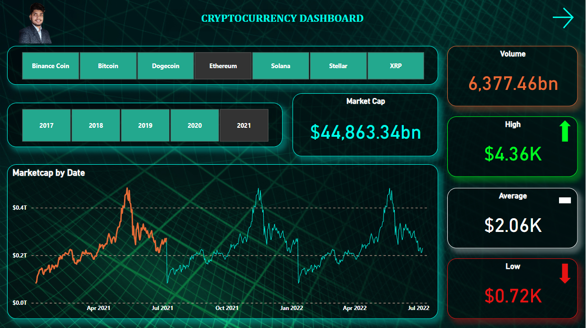
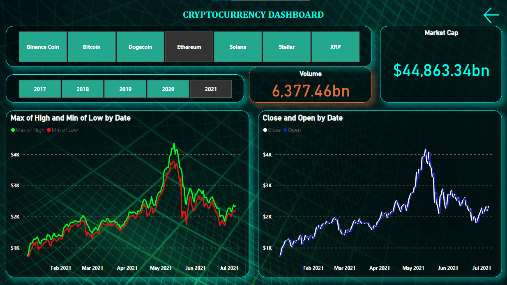
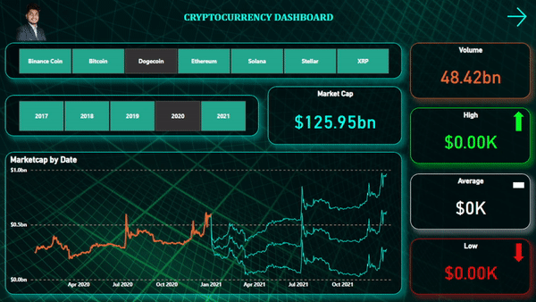

## Cryptocurrencies Dashboard with Forecasting using PowerBI
## Table of Content
  * [Demo](#demo)
  * [Problem Statement](#problem-statement)
  * [Approach](#approach)
  * [Technologies Used](#technologies-used)
  * [Bugs & Logs](#bugs--logs)
  * [Contributors](#contributors)

## Demo
PowerBI Dashboard : [https://app.powerbi.com/links/b8Sbw3ULWL?ctid=6d2f8f03-c411-4299-9bbd-870e5b287ccd&pbi_source=linkShare&bookmarkGuid=ee6205bc-77f3-4fe6-ac3d-6468234f2b9f](https://app.powerbi.com/links/b8Sbw3ULWL?ctid=6d2f8f03-c411-4299-9bbd-870e5b287ccd&pbi_source=linkShare&bookmarkGuid=ee6205bc-77f3-4fe6-ac3d-6468234f2b9f)

## Screenshots

## Problem Statement
In this project we will analyze the performance of crypto currencies and will forecast next 1 year with the help of past performance. Also we need to build interactive dashboard with realtime data.

## Approach
Downloading Dataset from Kaggle

Combining multiple excel file into one main file

Imported the dataset from excel to PowerBI

Data analysis using PowerBi : ETL, Dax queries, Realtime Dashboard

Published both report/dashboards on web for easy access to public.

## Technologies Used
Excel
PowerBi
Dax 

## Bugs & Logs

1. If you find a bug, kindly open an issue and it will be addressed as early as possible. [Open](https://github.com/hrishikeshkini/Cryptocurrency-dashboard-with-forecasting-using-powerBI/issues)

## Contributors
  [Hrishikesh Kini](https://github.com/hrishikeshkini)

